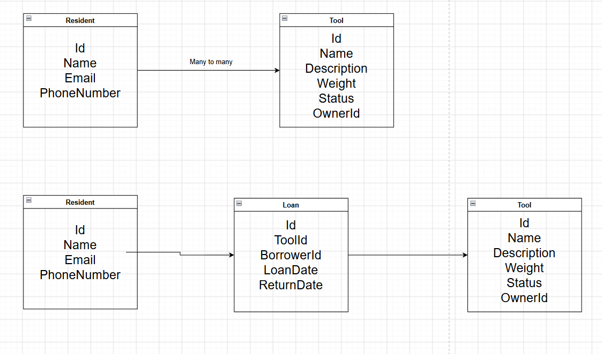

# Community Sharing System

- Residents can **offer** tools
- Residents can **borrow** tools.

The system needs to know:
- what tools exist
- what's available
- what's on loan
- who currently has a tool

# Data model Draft
## Resident table

| Id (primarykey) | Name | Email | PhoneNumber |

## Tool table

| Id (primarykey) | Name | Description | Weight | Status | OwnerId (foreignkey) |

## Loan table

| Id | ToolId (foreignkey) | BorrowerId (foreignkey) | LoanDate | ReturnDate |

### ER diagram

- Resident (1) ---- (*) Tool
- Resident (1) ---- (*) Loan
- Tool (1) ---- (*) Loan

>maybe add category

